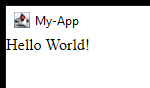

# Desku
Java Framework for developing Desktop Applications with Java, HTML and CSS.
[Click here for Maven/Gradle/Sbt/Leinigen instructions](https://jitpack.io/#Osiris-Team/Desku/LATEST) (Java 8 or higher required).

```java
public class Main {
    public static void main(String[] args) throws IOException {
        // Setup app details
        App.name = "My-App";

        // Create routes
        Route home = new MRoute("/", () -> { // It's recommended to create a new class and extend Route instead (for larger UIs)
            return new Layout().add(new Text("Hello World!")); 
        });

        // Create windows
        new NativeWindow(home);
    }
}
```


A more complete example can be found at the [Desku-Gradle-Starter-App](https://github.com/Osiris-Team/Desku-Gradle-Starter-App)
repo.

### Features
- Latest Chromium HTML/CSS renderer via [JCEF](https://github.com/jcefmaven/jcefbuild).
- Runs on Windows/Linux/Mac by installing platform-specific dependencies at first launch.
- Minimal memory and cpu usage since no additional JavaScript engine (Node.js) is being used.
- Localhost-free and server-less.
- Full Java [FlexBox](https://css-tricks.com/snippets/css/a-guide-to-flexbox/) 
implementation, thus making simple/complex layout creation faster and easier than ever.

### Extensions
A list of all available extensions can be found [here](https://github.com/topics/desku-extension?o=desc&s=updated).
It can be a single component or a complete suite of multiple components, either
way its pretty easy to create a Desku-Extension:
1. Add the Desku dependency.
2. Extend the Component class and start coding (example component [here](https://github.com/Osiris-Team/Desku/blob/main/src/test/java/com/osiris/desku/VerticalLayout.java)).
3. Publish your repo on GitHub with the #desku-extension tag/topic.
4. Create a release and use JitPack or Maven to host the assets.

### Todo
- Serializable UI
- Default components suit similar to https://vaadin.com/docs/latest/components
